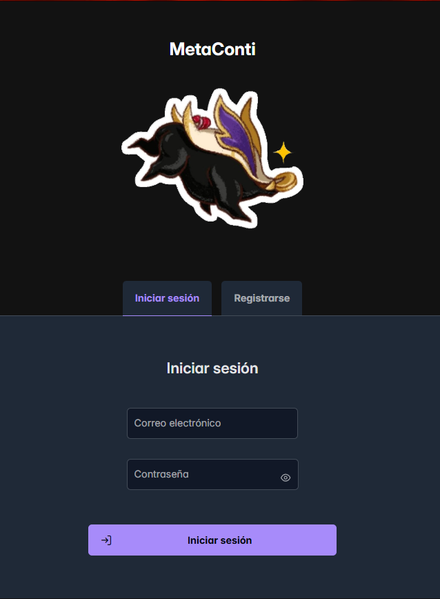
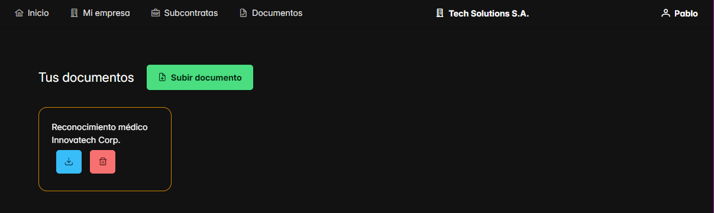
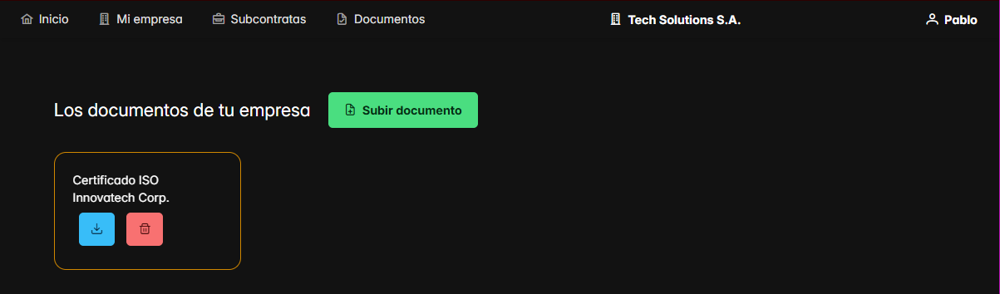
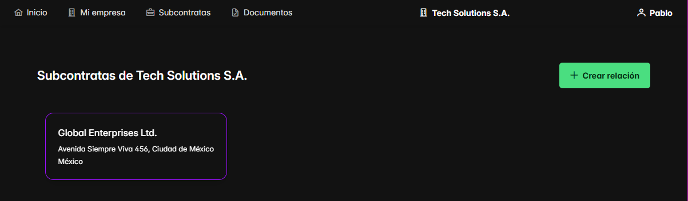
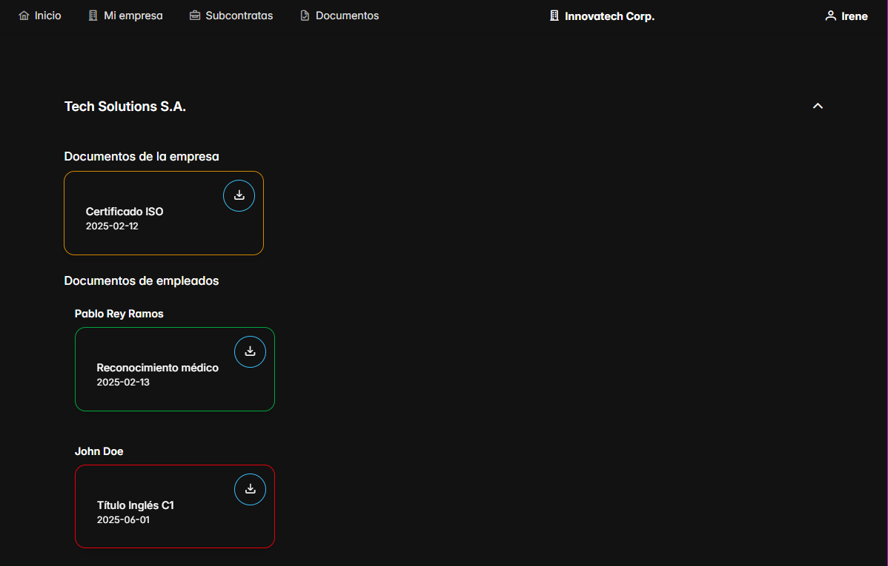

# 🌟 MetaConti – DAM – Pablo Rey Ramos

[](https://opensource.org/licenses/Apache-2.0)

## Índice
1. [Introducción](#introducción)
2. [Funcionalidades del proyecto y tecnologías utilizadas](#funcionalidades-del-proyecto-y-tecnologías-utilizadas)
3. [Guía de instalación](#guía-de-instalación)
4. [Guía de uso](#guía-de-uso)
5. [Documentación](#documentación)
6. [Diseño de la interfaz en Figma](#diseño-de-la-interfaz-en-figma)
7. [Conclusión](#conclusión)
8. [Contribuciones, agradecimientos y referencias](#contribuciones-agradecimientos-y-referencias)
9. [Licencia](#licencia)
10. [Contacto](#contacto)

---

## Introducción

_MetaConti_ es una aplicación web destinada a empresas contratistas y a sus subcontratas correspondientes. Ofrece un portal
de gestión empresarial y documental, para iniciar contratos, validar documentos, modificar información, etc.

Hoy día, la subcontratación es un fenómeno cada vez más común, especialmente en entornos de grandes empresas donde se mueven
grandes cantidades de dinero. Asociada a ello, existe una gran maraña burocrática y numerosas complejidades legales, laborales,
judiciales y financieras. Por ello, las empresas contratistas requieren de un _software_ que les permita agilizar el trabajo
y la gestión relacionada con sus subcontratas.

En esta aplicación, se busca aportar una solución para el problema de estas empresas, de forma que puedan subir documentos
de forma segura y se pueda obtener y modificar la información de las subcontratas, todo desde una plataforma centralizada.

La versión de producción de _MetaConti_ se aloja en [este enlace](https://react-dam.vercel.app).

---

## Funcionalidades del proyecto y tecnologías utilizadas

La aplicación _MetaConti_ permitirá:
- El registro y autenticación de usuarios.
- La modificación de la información pública tanto de nuestra empresa como de nuestro perfil.
- La subida, modificación y borrado de documentos para contratistas de nuestra empresa (tanto propios como de la empresa a la que 
pertenecemos).
- El inicio, la modificación y el cese de relaciones contractuales con empresas subcontratadas.
- La validación de documentos subidos por subcontratas.

Para este proyecto, se hará uso de una base de datos [MySQL](https://www.mysql.com). Los datos serán consultados y modificados
por un _backend_ Java, que implementará el _framework_ Quarkus. Esta API será atacada por nuestra aplicación web, que usa React
con Vite.

[Quarkus](https://quarkus.io) es un _framework_ para [Java](https://www.java.com/es/) orientado al desarrollo en la nube lanzado en
2019, diseñado para integrarse a la perfección en entornos de contenedores. Hace años, las aplicaciones monolíticas se alojaban
en un servidor físico con tiempos de arranque tediosos y alto coste de memoria. Con la llegada de los contenedores, [Docker](https://www.docker.com),
[Kubernetes](https://kubernetes.io) y la nube, Quarkus se postuló como una fuerte alternativa a [Spring](https://spring.io) gracias
a su rápido despliegue en contenedores, su compilación a nativo con [GraalVM](https://www.graalvm.org) y su integración de la programación
reactiva. Ofrece una gran suite de librerías, inyectables mediante "extensiones", y sigue muchas de las especificaciones y estándares
más usados (CDI, JAX-RS, JPA, JTA, [MicroProfile](https://microprofile.io), [Vert.x](https://vertx.io), [Camel](https://camel.apache.org),
[Jakarta EE](https://jakarta.ee), [OpenTelemetry](https://opentelemetry.io), etc.)

[React](https://react.dev) es una librería para JavaScript que permite al desarrollador construir la interfaz deseada a partir de
piezas individuales reutilizables llamadas "componentes", construidas a partir de funciones básicas integradas en sus archivos
particulares, llamados JSX, que juntan marcado con código. Para añadir funcionalidades extra propias de una aplicación reactiva
de _frontend_, React se vale de los llamados "_hooks_" para establecer variables renderizables, navegación, ejecuciones en bucle,
referencias a elementos renderizados, etc.

Para crear este proyecto de React se ha utilizado [Vite](https://vite.dev), una herramienta de compilación para _frontend_
con una capacidad de servicio increíblemente veloz y HMR (capacidad de reflejar los cambios en la interfaz) muy rápida. Ya
le da soporte a algunos de los _frameworks_ más usados para el desarrollo web, como son [Angular](https://angular.dev/),
[VueJS](https://vuejs.org/), [Preact](https://preactjs.com/), [Astro](https://astro.build/), [Laravel](https://laravel.com/), etc.
Al tener compatibilidad con [TypeScript](https://www.typescriptlang.org), se ha optado por elegir este lenguaje para la aplicación
web, dada la robustez que aporta su tipado.

Para facilitar la generación y usabilidad de los componentes, se han usado elementos de [PrimeReact](https://primereact.org/)
en campos de formulario, desplegables, menús y demás.

En el _frontend_ también se ha empleado [TailwindCSS](https://tailwindcss.com) para agilizar el estilizado de los componentes,
manteniendo un diseño moderno y minimalista.

La base de datos de producción se ha alojado en [FreeSQLDatabase](https://www.freesqldatabase.com). La API se ejecuta en una
instancia de un contenedor de [Render](https://render.com) que es consumida por la aplicación web, desplegada en [Vercel](https://vercel.com).

---

## Guía de instalación

<!--  
Pasos para clonar el repositorio  
Dependencias y requisitos previos  
Instrucciones para ejecutar la aplicación localmente  
-->
Antes de clonar y ejecutar los proyectos localmente, debe asegurarse de que tiene instalado en su sistema:
- [Git](https://git-scm.com)
  - Necesario para el clonado de los repositorios.
  - Puede comprobar su versión de Git instalada con:
  ```bash
  git -v
  ```
- [Java 17](https://jdk.java.net/archive/)
    - La versión de Java más compatible con Quarkus 3.x, y la más usada actualmente.
    - Puede comprobar su versión de Java instalada con:
    ```bash
    java -version
    ```
    Si no tiene Java 17, puede descargarlo buscándolo en la web del enlace, o instalarlo mediante su gestor de paquetes.


- [Maven](https://maven.apache.org)
    - Herramienta de construcción utilizada por el _backend_ de Quarkus.
    - Puede comprobar su versión de Maven instalada con:
    ```bash
    mvn -v
    ```
    Si no tiene Maven, puede descargarlo en la web del enlace, o instalarlo mediante su gestor de paquetes.


- [Node.js](https://nodejs.org/es) y [NPM](https://www.npmjs.com)
    - Vite y React utilizan Node.js para ejecutarse. NPM es el gestor de paquetes de Node.js que te permitirá instalar las dependencias.
    - Puede comprobar sus versiones de Node.js y NPM instaladas con:
    ```bash
    node -v
    npm -v
    ```
    Si no tiene Node.js, puede descargarlo en la web del enlace.


- [MySQL Server](https://www.mysql.com)
    - Versión 5.7 o superior.
    - Asegúrate de poder acceder a MySQL localmente en el puerto 3306.
    - Puede comprobar su versión de MySQL instalada con:
    ```bash
    mysql --version
    ```
    Si no tiene MySQL, puede descargarlo en la web del enlace.

Para clonar los repositorios sólo necesita ejecutar los siguientes comandos:
- API de Quarkus
```bash
# Sitúate en la carpeta donde quieras clonar el backend
cd ~/Proyectos
git clone https://github.com/pablo-rey-r03/proyecto-dam.git
cd proyecto-dam
```
- _Frontend_ de React
```bash
# Sitúate en la carpeta donde quieras clonar el frontend
cd ~/Proyectos
git clone https://github.com/pablo-rey-r03/react-dam.git
cd react-dam
```
Configura MySQL para que se conecte correctamente con la API de Quarkus. Por defecto, la API de Quarkus se conectará a una
base de datos MySQL `sql7782531` con usuario `root` y contraseña `root`.

En la carpeta raíz del _backend_, ejecuta:
```bash
mvn clean install
```
Tras instalar las dependencias y comprobar que se ha compilado correctamente, puedes levantar la API en modo desarrollo con:
```bash
mvn quarkus:dev
```
La API estará disponible en ``http://localhost:8080/metaconti/api/v1`` (o el _endpoint_ raíz configurado). Las CORS están
habilitadas en el archivo de configuración ``application.properties``, así que tu _frontend_ podrá consumirla sin problema.

Para ejecutar la parte web de la aplicación, desde la raíz del proyecto ``react-dam``, ejecutar:
````bash
npm install
````
Esto instalará React, Vite, Tailwind CSS y todas las demás librerías especificadas en el archivo ``package.json``.

En la carpeta ``/src`` existe un archivo ``vite-env.d.ts``, donde se pueden importar las variables de entorno necesarias.
En nuestro caso, la variable ``VITE_API_URL`` será la URL de la API que será consumida por el _frontend_. En los archivos
``.env.development`` y ``.env.production`` se establece su valor según el perfil de ejecución. De esta forma, Vite sabe
si consumir una URL u otra según si la aplicación se ejecuta en desarrollo o en producción.

Una vez nos aseguramos de que nuestra base de datos MySQL está funcionando y nuestra API Quarkus se conecta a ella correctamente,
podemos ejecutar, desde la raíz del proyecto React:
````bash
npm run dev
````
Vite iniciará el proyecto en modo desarrollo en ``http://localhost:5173``. Accediendo a la URL en el navegador, podremos
visualizar la interfaz web inicial.

---

## Guía de uso

### Pantalla de autenticación


Al acceder a la aplicación web, veremos la pantalla de autenticación donde podremos escoger iniciar sesión o registrarnos.
Ambas opciones, tras cumplimentar debidamente los respectivos formularios, nos llevarán a la página de inicio.

### Pantalla inicial


Como podremos apreciar, la barra superior se mantendrá fija a lo largo de toda la aplicación, sirviéndonos de ancla de
navegación. Al pulsar el nombre de nuestra empresa, podremos modificar su información. Al pulsar nuestro nombre, podremos
tanto modificar nuestro perfil como cerrar sesión y volver a la pantalla de autenticación.

En esta pantalla inicial podremos visualizar los documentos propios que hemos subido, su estado de validación, etc.
Podremos modificarlos haciendo clic sobre ellos, borrarlos pulsando el botón rojo o descargar su archivo adjunto pulsando
el botón azul.

### Pantalla de nuestra empresa


Esta página comparte todas las funcionalidades de la anterior pantalla, solo que en este caso gestionaremos los documentos
de nuestra empresa, no nuestros propios.

### Pantalla de subcontratas


En esta pantalla podremos gestionar las relaciones contractuales que establecemos con otras empresas subcontratadas por
la nuestra. Podemos modificarlas, eliminarlas o crearlas. Al crearlas, podremos elegir entre una de las empresas registradas
y una nueva que registraremos en el acto.

El resultado de las operaciones en esta pantalla repercutirá en las empresas que podremos elegir como destinatarias de
nuestros documentos, a la hora de registrarnos, etc.

### Pantalla de validación


Por último, en esta pantalla trataremos los documentos de nuestras empresas subcontratadas. Podremos establecer su fecha
de expiración (si procede), y sobre todo, modificar su estado de validación.

Un documento puede estar:
- Validado
- Pendiente de validación
- Erróneo
- Expirado

---

## Documentación

En [este documento](./MetaConti.pdf) puede consultar la documentación
avanzada del proyecto, especialmente los diagramas y modelos UML de la aplicación.

---

## Diseño de la interfaz en Figma

En [este enlace](https://www.figma.com/proto/JGjq1dDmNDUdeyxRVTKuOp/MetaConti?node-id=0-1&t=omiFQAORmfdanFGR-1) podrá
ver el diseño aproximado de la interfaz web en [Figma](https://www.figma.com/es-es/) a través de una simulación interactiva.

Si, por el contrario, desea acceder al proyecto de Figma al completo con todos los componentes, haga clic en
[este enlace](https://www.figma.com/design/JGjq1dDmNDUdeyxRVTKuOp/MetaConti?node-id=0-1&t=omiFQAORmfdanFGR-1).

---

## Conclusión

Este proyecto me ha permitido conocer a fondo tecnologías que no pensaba usar nunca voluntariamente, lo cual que ha ayudado
a enriquecer mi experiencia como desarrolador.

Como ferviente desarrollador _backend_, React nunca me convenció totalmente, pero debo decir que tras lidiar con él he
llegado a cogerle el truco.

Por el contrario, a pesar de nunca haber oído hablar de Quarkus hasta hace pocos meses, me ha gustado mucho como alternativa
a Spring. Estoy seguro de que acabará imponiéndose y la experiencia de desarrollo es increíblemente fluida.

Aunque el proyecto es una MVP funcional, hay muchos aspectos a mejorar en el futuro, empezando por el diseño y el estilo
de la app. A nivel de buenas prácticas de programación, la API debería tratar más los datos y tener más endpoints especializados,
pero de momento es un punto de partida válido.

Considero que, implementando mejoras prácticas y dando soporte al proyecto, podría llegar a ser una aplicación de utilidad
real; quizás algún día pueda llegar a ser comercial.

---

## Contribuciones, agradecimientos y referencias

### Contribuciones
- **Pablo Rey**
  - Diseño y desarrollo del frontend utilizando PrimeReact y Tailwind CSS.
  - Desarrollo de la API de Quarkus, incluidos modelos, repositorios, utilidades, controladores, pruebas unitarias, etc.
  - Diseño de la base de datos MySQL mediante _scripts_ de creación e inserción de datos de prueba.
  - Despliegue de la base de datos en FreeSQLDatabase.com y mantenimiento de CI/CD en Render y Vercel.

### Agradecimientos
Quisiera expresar mi sincero agradecimiento a las siguientes personas e instituciones:

- **José Carlos Moreno (tutor del curso)**  
  Por su apoyo, dedicación y entrega durante el curso, siempre priorizando nuestra comodidad en la formación.

- **Jorge Juan Muñoz (profesor coordinador del proyecto)**  
  Por su guía, soporte y valiosas sugerencias a lo largo del proyecto y del curso, incentivando al pensamiento crítico.

- **Joaquín Borrego (profesor)**  
  Por sus numerosas explicaciones y disponibilidad ilimitada a la hora de resolver dudas y solucionar problemas.

- **Colegio Santa Joaquina de Vedruna**  
  Por ser, durante unos pocos meses, una segunda casa para mí.

### Referencias

- [React](https://react.dev/learn)
- [PrimeReact](https://primereact.org/installation/)
- [Quarkus](https://quarkus.io/get-started/)
- [Tailwind CSS](https://tailwindcss.com/docs/installation/using-vite)
- [JSON Web Token](https://jwt.io/)

---

## Licencia

Este proyecto se publica bajo la **Apache License 2.0**.  
Puede consultarse el texto completo de la licencia en el fichero [`LICENSE`](./LICENSE).

> **Resumen de condiciones principales** (para referencia rápida):
> - Permiso para usar, copiar, modificar y distribuir el software, siempre que se mantengan los avisos de copyright y la
> nota de licencia.
> - No se ofrece ninguna garantía (el software se proporciona “tal cual”).
> - Si redistribuyes el código modificado, debes incluir la misma licencia.


---

## Contacto

Si tienes preguntas, sugerencias o quieres colaborar, no dudes en ponerte en contacto:

- **Correo electrónico**: pablo.rey.ramos.03@gmail.com

- **[LinkedIn](https://www.linkedin.com/in/pablo-rey-ramos/)**  

- **[GitHub](https://github.com/pablo-rey-r03)**

¡Estaré encantado/a de escuchar tu feedback!
